# PharmaPulse

**Demand planning, working-capital, and inventory intelligence for a pharmaceutical manufacturer & distributor.** A synthetic, large-scale (~430K-row) dataset for a fictional company, "Aurora Pharmaceuticals" (3 plants, 14 distribution centers, 42 SKUs across 9 therapeutic categories, an upstream network of 51 raw materials and 8 suppliers), a global LightGBM quantile-forecasting model, ABC/XYZ inventory segmentation, quantile-based safety-stock planning, expiry/waste-risk analysis, a full **Cash Conversion Cycle (DIO/DSO/DPO)** working-capital model, and raw-material supply/production risk metrics - all rendered into a 9-sheet Excel workbook and a standalone interactive HTML dashboard from one source of truth.

[](https://github.com/Milad-Shabani/pharmapulse-demand-planning/actions)


> ⚠️ **All data in this repository is synthetically generated.** "Aurora Pharmaceuticals" is fictional. Drug names are real generic (INN) substances, used only to ground seasonal demand patterns in real epidemiology. See [Data provenance](#data-provenance).

---

## The business problem

Aurora's 14 distribution centers currently run on a simple periodic-review reorder policy based on trailing demand averages. As the business has grown, that policy hasn't kept up: **network fill rate degraded from 84.5% in 2023 to 81.0% in 2024** even as revenue grew. Upstream, several APIs are single-sourced from overseas suppliers running 76-87% on-time delivery with 45-60 day lead times - a real production risk if not tracked. And Aurora's cash is tied up for roughly **56-60 days** between paying suppliers and collecting from hospitals and pharmacy chains - working capital that better forecasting and planning can help release.

This project builds the forecasting and planning layer that addresses all three: a global demand-forecasting model good enough to drive real reorder-point recommendations, upstream supply-chain risk made measurable (not just assumed), and a working-capital view that ties inventory policy directly to cash.

## What's inside

| Layer | What it does |
|---|---|
| **Data generation** | 42 SKUs x 14 centers x 731 days of realistic, seasonally-correct demand; production batches with expiry dates; a genuine (s,S) finished-goods inventory simulation; a 51-material / 8-supplier upstream network with a bill-of-materials and a procurement simulation |
| **Forecasting** | One global LightGBM model (not 588 per-series models) trained with **quantile regression** at P50 and P95 - the P95 quantile doubles as a distribution-free safety-stock buffer |
| **Planning** | ABC (revenue) x XYZ (variability) segmentation; quantile-based reorder point / order-up-to recommendations; FIFO-approximate expiry/waste-risk flagging; supplier on-time performance; raw-material days-of-cover vs. lead time |
| **Working capital** | A full **Cash Conversion Cycle** model (DIO + DSO − DPO) driven by a mechanistic receivables/payables ledger, reported as a 60-day trailing trend |
| **Reporting** | A 9-sheet Excel workbook with native charts, and a standalone interactive HTML dashboard (red/orange theme) - both rendered from the same computed tables |

## Results at a glance

| Metric | Value |
|---|---:|
| Forecast accuracy (WAPE, 12-week holdout) | **3.24%** |
| Forecast R² | **0.977** |
| P95 interval coverage (target: 95%) | **93.8%** |
| Current network fill rate | 82.7% (degrading YoY - see above) |
| **Cash Conversion Cycle** | **~56 days** (DIO 13d + DSO 72d − DPO 30d) |
| Supplier on-time delivery (network) | 86.6% (76-87% for overseas API suppliers) |

Full breakdown in [`reports/model_performance.csv`](reports/model_performance.csv), [`reports/working_capital.csv`](reports/working_capital.csv), [`reports/supplier_performance.csv`](reports/supplier_performance.csv), and [`docs/methodology.md`](docs/methodology.md).

## Architecture

```mermaid
flowchart LR
    subgraph Gen["Data Generation"]
        PR[products.py] --> DC[demand_curve.py]
        CP[centers_and_plants.py] --> DC
        DC --> BA[batches.py]
        DC --> INV[inventory_sim.py]
        RM[raw_materials.py] --> PROC[procurement.py]
        BA --> PROC
    end

    subgraph Raw["data/raw/ (~430K+ rows)"]
        R1[daily_demand.parquet]
        R2[production_batches.csv]
        R3[inventory_ledger.parquet]
        R4[purchase_orders.csv + raw_material_inventory.parquet]
    end

    subgraph Feat["Feature Engineering"]
        FE[build_features.py<br/>daily → weekly, lags, rolling stats]
    end

    subgraph Model["Global Forecasting"]
        LGBM[LightGBM Quantile Models<br/>P50 + P95, one model for all 588 series]
    end

    subgraph Plan["Planning & Working Capital"]
        ABC[ABC/XYZ segmentation]
        SS[Safety stock / reorder point]
        EXP[Expiry / waste risk]
        CCC[CCC: DIO + DSO - DPO]
        SUP[Supplier & material risk]
    end

    subgraph Out["reports/"]
        XL[PharmaPulse_Planning_Report.xlsx]
        HTML[pharmapulse_dashboard.html]
    end

    Gen --> Raw --> Feat --> Model --> Plan --> Out
```



## Repository layout

```
pharmapulse-demand-planning/
├── src/pharmapulse/
│   ├── data_generation/     # products, network, demand, batches, inventory sim,
│   │                        # raw materials/suppliers/BOM, procurement simulation
│   ├── features/            # daily -> weekly feature engineering
│   ├── models/               # global LightGBM quantile model + metrics
│   ├── planning/             # ABC/XYZ, safety stock, expiry risk,
│   │                        # working capital (CCC), supplier/material risk
│   └── reporting/            # Excel workbook + HTML dashboard builders
├── scripts/
│   ├── generate_sample_data.py     # produces data/raw/*
│   ├── run_pipeline.py             # features -> forecast -> planning -> CCC -> reports
│   ├── publish_to_github.sh        # one-shot publish (Linux/macOS)
│   └── publish.bat                 # one-shot publish via GitHub CLI (Windows)
├── data/raw/                 # generated synthetic source data (committed)
├── data/processed/           # weekly features + forecast parquet (committed)
├── reports/                  # PharmaPulse_Planning_Report.xlsx + dashboard.html (committed)
├── docs/                     # data dictionary + methodology
├── tests/                    # 26 pytest unit tests
└── .github/workflows/ci.yml  # regenerates everything + tests on every push
```

## Getting started

```bash
git clone https://github.com/Milad-Shabani/pharmapulse-demand-planning.git
cd pharmapulse-demand-planning
pip install -r requirements.txt

# 1. Generate the synthetic dataset (deterministic, seeded, ~2 seconds)
python scripts/generate_sample_data.py

# 2. Run the full pipeline: features, forecasting, planning, both reports
python scripts/run_pipeline.py

# 3. Run the test suite
pytest tests/ -v
```

Or with `make`: `make install data pipeline test`.

Open `reports/pharmapulse_dashboard.html` directly in a browser (no server needed - Plotly is embedded inline), or `reports/PharmaPulse_Planning_Report.xlsx` in Excel.

**Publishing to GitHub:** on Windows (with [GitHub CLI](https://cli.github.com/) installed and `gh auth login` already run), edit the `cd /d` path at the top of `scripts\publish.bat` and run it. On Linux/macOS, create an empty repo on github.com first, then run `./scripts/publish_to_github.sh <remote-url>`.

## Why a global model instead of 588 per-series models?

At 42 SKUs x 14 centers there are 588 individual demand series. Fitting and maintaining 588 separate models is exactly the kind of operational burden real demand-planning teams try to avoid - and many of those series (a slow-moving SKU at a small rural center) simply don't have enough individual history to model well on their own. A **single global LightGBM model**, trained across all series with product/center/category/region encoded as categorical features, borrows statistical strength across similar SKUs and centers - the same architecture used in the M5 forecasting competition and in production systems at large retailers and distributors. See [`docs/methodology.md`](docs/methodology.md) for the full reasoning.

## Why quantile regression instead of mean + z·σ safety stock?

The classical safety-stock formula (`mean demand + z * σ`) assumes demand is Normally distributed. Several categories here - antibiotics during flu season, allergy medication during pollen season - have sharply right-skewed, promotion- and season-driven demand that a Normal assumption underestimates. Training the *same* LightGBM model at `objective="quantile"`, `alpha=0.95` produces a P95 forecast that captures each series' actual (possibly skewed) demand distribution directly, and the gap between P50 and P95 becomes the safety-stock buffer - no distributional assumption required.

## Cash Conversion Cycle: connecting inventory policy to cash

`CCC = DIO + DSO - DPO` is computed as a genuine 60-day trailing metric, not a static assumption:

- **DIO** comes directly from the simulation - finished-goods inventory value (from the (s,S) policy) plus raw-material inventory value (from the procurement simulation), divided by trailing COGS.
- **DSO** and **DPO** are driven by a mechanistic receivables/payables ledger (each day's revenue/COGS flows in, and the flow booked N days earlier flows back out), parametrized with realistic healthcare-distribution terms: 75-day customer collections (hospitals and pharmacy chains are slow payers) against 30-day supplier payment terms.

The result settles at a **~56-60 day CCC**, visualized as a trend (not just a single number) on the dashboard, so a finance or ops stakeholder can see whether working capital is improving or deteriorating over time - not just where it stands today. Full mechanism in [`docs/methodology.md`](docs/methodology.md#6-working-capital-the-cash-conversion-cycle).

## Raw materials & production risk

Beyond finished-goods planning, the project models the **upstream** side: 51 raw materials (dedicated APIs per SKU, plus shared excipients and packaging) sourced from 8 suppliers, with a genuine day-by-day procurement simulation. Overseas API suppliers - the ones the business depends on most - run at 76-87% on-time delivery with 45-60 day lead times, materially worse than domestic excipient/packaging suppliers (92-97% on-time, 8-18 day lead times). The dashboard surfaces this directly via supplier on-time-rate charts and a raw-material "days of cover vs. lead time" view, so a supply risk becomes visible before it turns into a missed production batch.

## Data provenance

This project ships **entirely synthetic** data:

- Company, plants, and distribution centers are fictional.
- Product names use real generic (INN) drug substances (e.g. Paracetamol, Amoxicillin, Atorvastatin) so that category-level seasonality is grounded in genuine epidemiological patterns rather than arbitrary curves.
- All revenue, unit costs, demand volumes, and inventory figures are simulated.
- Suppliers, raw materials, purchase orders, and accounts receivable/payable balances are simulated - the DSO (75-day) and DPO (30-day) collection/payment terms are illustrative assumptions chosen to produce a realistic healthcare-distribution CCC, not figures from any real company's financial statements.

Full generation methodology and every design decision is documented in [`docs/methodology.md`](docs/methodology.md) and [`docs/data_dictionary.md`](docs/data_dictionary.md). Nothing here should be cited as real company data.

## Possible extensions

- Per-center-and-product SHAP explanations surfaced directly in the dashboard.
- A proper multi-echelon inventory optimization (plant -> DC -> pharmacy) instead of single-echelon (s,S).
- Prophet or TBATS as an additional baseline alongside the LightGBM global model.
- A live Streamlit app instead of a static HTML snapshot, for interactive what-if planning.
- Batch-level (not just product-level) expiry tracking through the distribution network via a lot-genealogy table.

## License

MIT - see [LICENSE](LICENSE).
